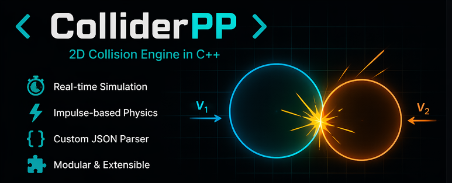
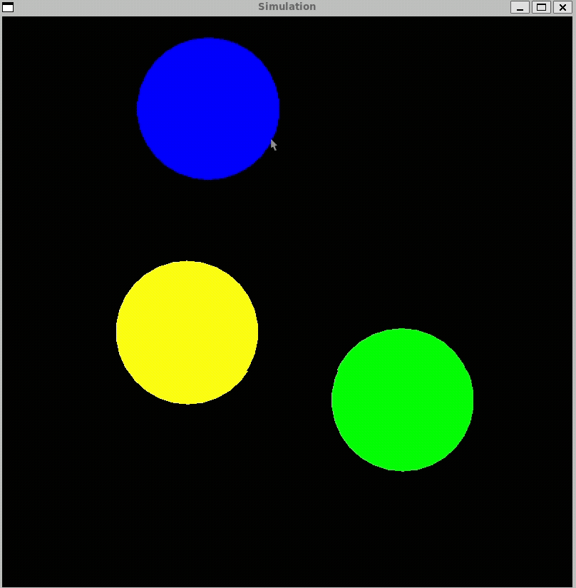
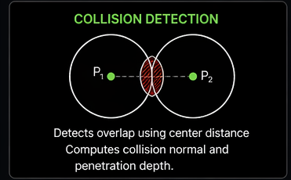
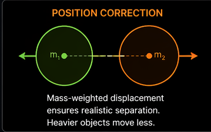
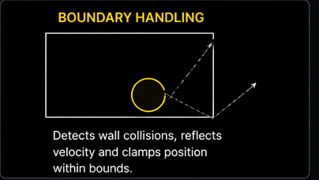
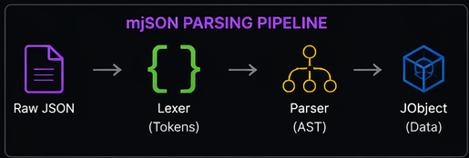

# Collider++

    

---

## Preview

  

---
## Desc:
This project focuses on building a robust and efficient collision detection and resolution system for complex, non-trivial objects. It targets advanced shapes such as concave polygons and objects bounded by mathematical curves, going beyond basic line and convex geometry.

The engine will implement industry-standard techniques including Axis-Aligned Bounding Boxes (AABB), the Separating Axis Theorem (SAT), and spatial partitioning to achieve accurate and high-performance collision handling. Emphasis is placed on clean, efficient implementations and a clear separation between broad-phase and narrow-phase collision detection.

If time permits, the project will be extended with a basic physics system and a custom render pipeline using OpenGL to visualize geometry, collisions, and physical interactions.

## Team

| Name | GitHub ID | Role |
|------|-----------|------|
| Sathvik | [VSathvikReddy](https://github.com/VSathvikReddy) | Lead |
| Anvesh | [ElementSnow10](https://github.com/ElementSnow10) | Lead |
| Akshat | [Akshat-Chaplot](https://github.com/Akshat-Chaplot) | Lead |
| Aarav | [aarav-prakash](https://github.com/aarav-prakash) | Member |
| Kanishka | [KanishkaDeveloper](https://github.com/KanishkaDeveloper) | Member |
| Dhivakar | [cs25b023-collab](https://github.com/cs25b023-collab) | Member |
| Ananya | [ananya-274](https://github.com/ananya-274) | Member |
| Prajith | [EntangledEquity](https://github.com/EntangledEquity) | Member |
| Sathwik | [ImagineLosing14](https://github.com/ImagineLosing14) | Member |

# Project Introduction

ColliderPP is a modular 2D collision engine built in C++ that simulates and visualizes real-time interactions between physical objects. 

It features a data-driven architecture where objects are loaded from JSON, updated using kinematic equations, and interact through impulse-based collision resolution.

## Motivation

This project was built to understand and implement the complete pipeline of a physics simulation engine—from data parsing and object modeling to real-time collision handling—without relying on external parsing libraries.

## Key Features

* Real-time 2D collision simulation
* Custom-built JSON parser (`mjson`)
* Data-driven object initialization
* Modular architecture (engine, objects, collision, parsing separated)
* Impulse-based collision response
* Mass-weighted collision resolution
* Boundary collision handling
* Frame-based update system using delta time

---

## Architecture

ColliderPP is divided into two main subsystems:

### 1. Physics & Simulation Engine

Handles object lifecycle, physics updates, collision detection/resolution, and rendering.

### 2. Configuration System (mjson)

Parses JSON input and converts it into structured data used to initialize simulation objects at runtime.

---

## System Flow

config.json → mjson (Lexer → Parser → JObject)
            → Simulation Setup
            → Physics Engine Loop:
                → Collision Detection
                → Collision Resolution
                → Object Update
                → Rendering
---

## Core Components

### Entry Point (`main.cpp`)

* Initializes the simulator
* Loads configuration file
* Starts simulation loop

---

### Simulation Layer (`simulation.cpp`)

* Creates rendering window
* Loads objects from JSON
* Handles event loop and frame updates
* Tracks FPS

---

### Physics Engine (`physics_engine.cpp`)

* Maintains list of all objects
* Performs pairwise collision checks (O(n²))
* Resolves:

  * Object-object collisions
  * Boundary collisions
* Updates and renders objects

---

### Physics Object Base (`physics_object.cpp`)

* Abstract representation of physical entities
* JSON-based initialization
* Stores:

  * Position, velocity, acceleration
  * Angular properties
  * Physical attributes (mass, restitution, etc.)
  ####
* Uses explicit Euler integration:
  * velocity += acceleration × dt  
  * position += velocity × dt  
* Angular motion handled similarly  
* Acceleration is reset each frame after integration

---

### Circle Implementation (`physics_circle.cpp`)

* Derived from `PhysicsObject`
* Represents circular bodies
* Syncs physics state with graphical representation

---

### Physical Attributes (`physics_attributes.cpp`)

Defines object behavior:

* Mass and angular mass
* Restitution (bounciness)
* Static/dynamic behavior
* Color mapping from string

---

## Collision System (`collision.cpp`)

### Collision Pipeline

The collision system is divided into two distinct phases:

1. Detection  
   Identifies whether two objects are intersecting  

2. Resolution  
   - Position correction (removes overlap)  
   - Velocity update (applies physical response)  

This separation ensures stable and predictable simulation behavior.

### Collision Detection

* Circle-circle collision detection based on distance between object centers
* Detects overlap and computes collision normal

    

### Position Correction

* Resolves overlap using mass-weighted displacement as heavier objects move less, improving physical realism.
* Prevents objects from sticking or penetrating

    

### Velocity Resolution

* Ensures physically consistent response using conservation of momentum principles
* Skips resolution if objects are separating
* Uses collision normal projection to compute relative velocity
* Handles edge cases (zero distance)

### Boundary Handling

* Detects collision with window edges
* Reflects velocity and clamps position

    

---

## Configuration System (mjson)

A lightweight custom JSON parser built from scratch.

    

### Components

#### Lexer (`lexer.cpp`)

* Converts raw input into tokens
* Supports:

  * Strings, numbers, booleans
  * JSON symbols (`{ } [ ] , :`)

#### Parser (`parser.cpp`)

* Recursive descent parser
* Builds structured data:

  * Lists (`vector<JObject>`)
  * Dictionaries (`unordered_map`)

#### JObject (`jobject.cpp`)

* Unified representation of all JSON types
* Supports:

  * Type-safe conversions
  * Operator overloading (`obj["key"]`)
  * Deep copy and move semantics

---

## File Structure

`src/`
`├── main.cpp`
`├── simulation.cpp`
`├── physics_engine.cpp`
`├── physics_object.cpp`
`├── physics_circle.cpp`
`├── physics_attributes.cpp`
`├── collision.cpp`
`└── mjson/
    ├── lexer.cpp
    ├── parser.cpp
    ├── jobject.cpp`

---

## How to Run

### Requirements

* C++ compiler (g++)
* SFML library installed

### Compile and Execute

`make run`

